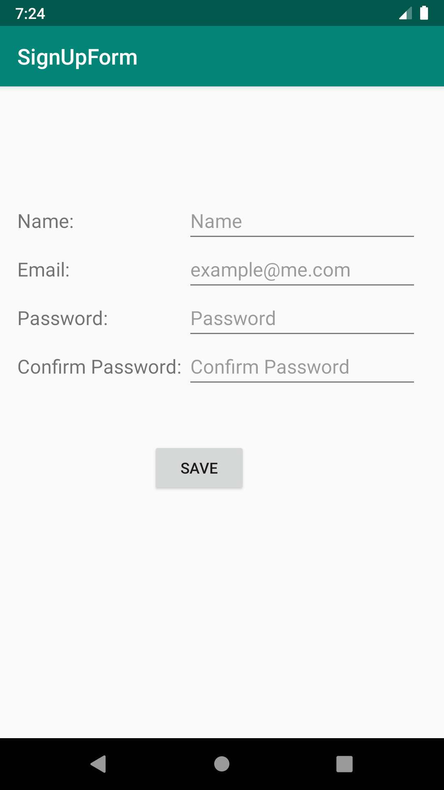

# SignUpForm

This is an Android application to collect a user's name, email, password and a password confirmation with a "Save" button. When the application is built successfully, the welcome message will display on the screen.

## Function

- Check that every field has data entered.
- Check the password and password confirmation matching.
- Check the application build successfully.
- Check the Welcome message to display.

## Screenshot

This is the screenshot to show this application is built.

